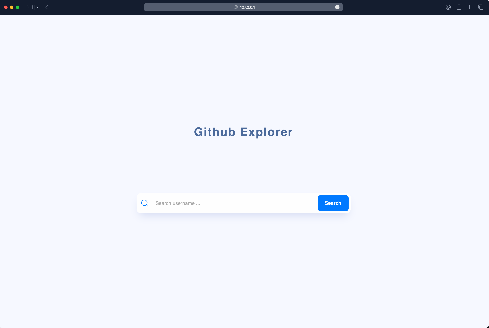
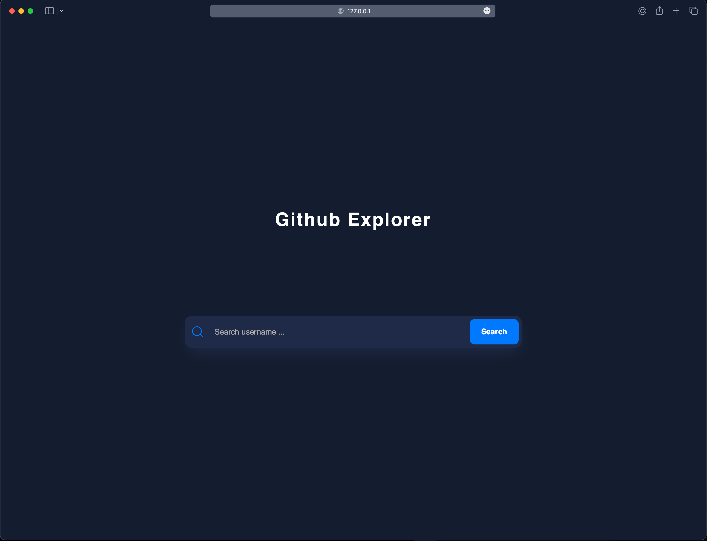

# Github Explorer

## Project Overview

**👨🏻‍💻 Hi everyone**
**The idea is to create a web application that allows the user to search for a user on Github and see the repositories of that user.**

### Main Technologies

- ReactJS
- Typescript
- React Router Dom
- Styled Components

To make this project more organized, I use ReactJS and Vite to create the project. I also use the Styled Components to create the styles of the project. To make the routes, I use the React Router Dom library.

## **👨🏻‍💻 To run this project**

### **👨🏻‍💻 You need to have NodeJS and Yarn installed on your machine.**

```jsx
~ git clone https://github.com/Gugusta/GithubExplorer.git
~ cd GithubExplorer
~ yarn
~ yarn dev
```

### **👨🏻‍💻 After running this project the following message will be showed on your terminal**

```jsx
VITE v4.0.4  ready in 287 ms

  ➜  Local:   http://127.0.0.1:5173/
  ➜  Network: use --host to expose
  ➜  press h to show help
```

**🌗The Project has Light and Dark Theme.**






## **📝 License**

This project is licensed under the MIT License - see the [LICENSE](notion://www.notion.so/gustavoserao/LICENSE) file for details.

Made with 💜 &nbsp;by Gustavo Serão 👋 &nbsp;[See my linkedin](https://www.linkedin.com/in/gustavoserao/)
